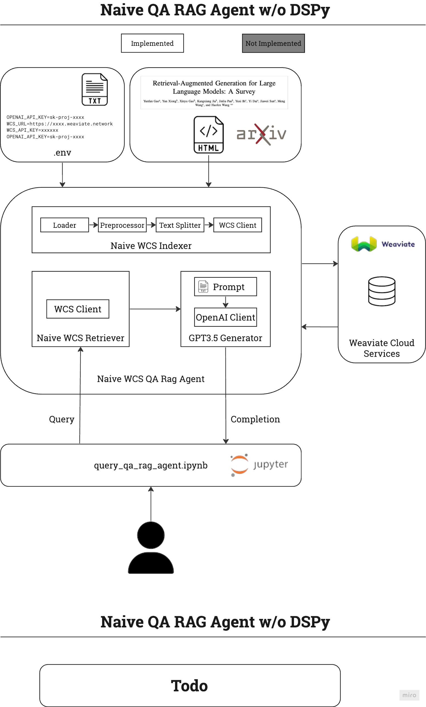

# paper-qa-agent
A RAG-based question-answer agent that supports the following HTML documents:
- [Retrieval-Augmented Generation for Large Language Models: A Survey](https://arxiv.org/html/2312.10997v5)
- [LLM Powered Autonomous Agents](https://lilianweng.github.io/posts/2023-06-23-agent/)
## Setup
### .env file setup
Create a `.env` file from this template. 
```
WCS_URL=https://xxxxx-xxxxxxxx.weaviate.network
WCS_API_KEY=xxxxxxxxxxxxxxxxxxxxxxxxxxx
OPENAI_API_KEY=sk-proj-xxxxxxxxxxxxxxxxxxxxxxxxxxxxxxxxxxxxxxxxxxxxxxxx
```
### Install dependencies
```
python -m venv venv
source venv/bin/activate
pip install -r requirements.txt
```
## Usage
Use `query_qa_rag_agent.ipynb`.

## Architecture


## Tech Debt
- `retrievers.py` and `vector_dbs.py` have some duplicate code
- Weaviate client management needs to be refactored to use the weaviate context manager [1]
- `preprocessors.py` 
  - formats tables weird
  - doesn't handle images
  - doesn't format subheadings correctly
- `vector_dbs.py`: vectorization strategy is declared here, and I think it makes more sense for it to be declared in `indexer.py`
- `indexers.py`: calling syntax doesn't make it clear what side effects the constructor has
- `dspy-rag-pipeline.ipynb`:
  - teleprompter parameters are unoptimized
  - both a global and contextualized language model are used, and this is harder to read. Change to contextualized LMs only

[1] https://weaviate.io/developers/weaviate/client-libraries/python#connection-termination